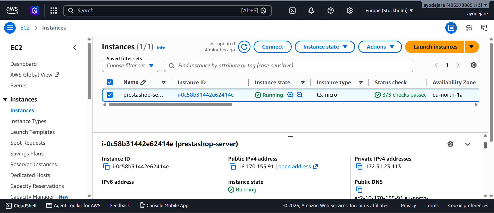
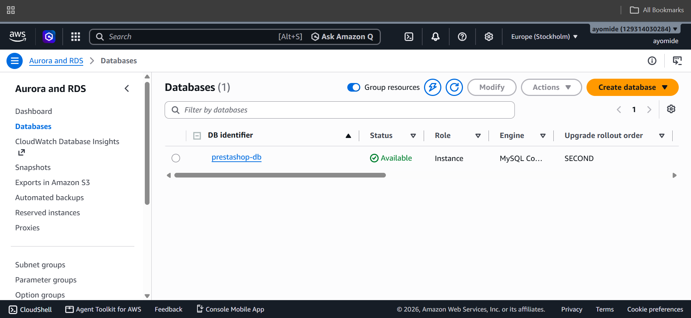
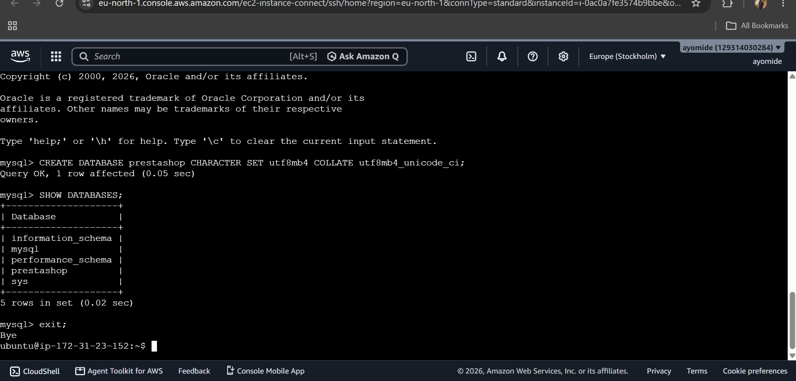
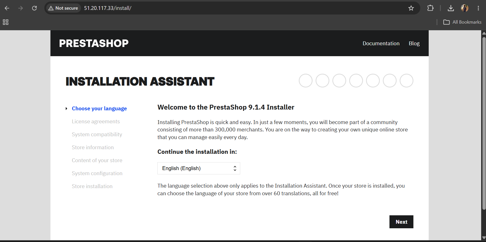
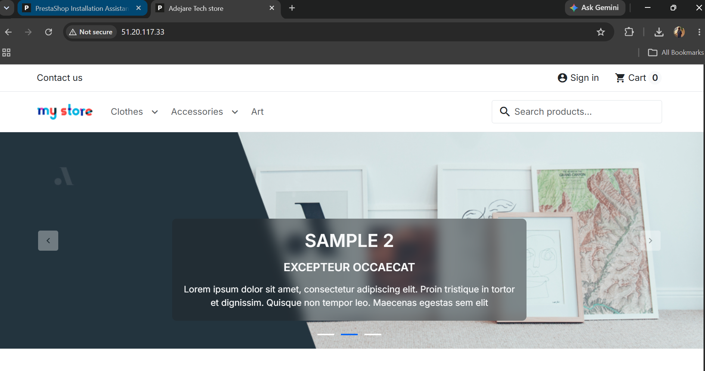

# PrestaShop Deployment on AWS

## Practical Assignment

This project demonstrates the deployment of the open-source PrestaShop e-commerce platform on an Amazon Web Services (AWS) EC2 server, with the database hosted separately using Amazon RDS.

## 1. Working PrestaShop Installation

**Public URL:**  
http://51.20.117.33/

The PrestaShop store is publicly accessible through the EC2 instance's public IPv4 address.

## 2. AWS Architecture

The implementation uses two separate AWS services:

- **Amazon EC2** – hosts the PrestaShop application and Apache web server.
- **Amazon RDS (MySQL)** – hosts the PrestaShop database separately from the application server.

This satisfies the requirement that the database must not be hosted on the same server as the application.

## 3. EC2 Server Configuration

A new EC2 instance was created using:

- Operating System: Ubuntu 24.04 LTS
- Instance Type: t3.micro
- Region: Europe (Stockholm) – eu-north-1
- Application Server: Apache
- Application: PrestaShop 9.1.4

### EC2 Instance



The EC2 instance is running successfully and has passed its status checks.

## 4. Amazon RDS Database

A separate Amazon RDS database was created for PrestaShop.

- Database Engine: MySQL
- Database Identifier: prestashop-db
- Database Name: prestashop
- Port: 3306

### RDS Database



The RDS database is available and is hosted separately from the EC2 application server.

## 5. Database Connectivity

The EC2 server was configured to communicate with the remote RDS MySQL database.

The MySQL client was used to verify connectivity to the RDS database.

### Database Connection



The connection was successfully established to the RDS MySQL server.

## 6. PrestaShop Installation

PrestaShop 9.1.4 was installed on the Ubuntu EC2 instance and configured to use the remote RDS database.

The PrestaShop installation assistant was accessed through the EC2 instance's public IP address.

### PrestaShop Installation Assistant



During installation, the RDS endpoint, database name, database username and database password were supplied.

## 7. Successful Store Deployment

After completing the installation, the PrestaShop store became publicly accessible through the EC2 instance.

### Working PrestaShop Store



## 8. Requirement Verification

| Implementation |
```
Create a new server instance - Amazon EC2 Ubuntu instance 
Install PrestaShop - PrestaShop 9.1.4 installed successfully 
Publicly accessible URL - EC2 public IPv4 address 
Database separate from application server - Amazon RDS MySQL 
Use AWS Free Tier - EC2 t3.micro and RDS Free Tier configuration 
Provide implementation documentation - Steps and screenshots included above 
```
## 9. Technologies Used

- Amazon EC2
- Amazon RDS
- Ubuntu 24.04 LTS
- Apache
- MySQL
- PrestaShop 9.1.4

## Conclusion

The PrestaShop application was successfully deployed on an AWS EC2 instance and made publicly accessible. The application's database is hosted separately on Amazon RDS, satisfying the assignment's database separation requirement.
